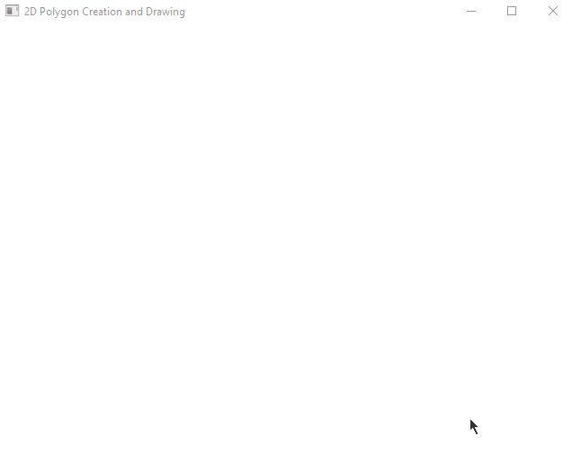

## Portfolio

### Time-Jumper
*Published on Steam*

Link to Steam page: [https://store.steampowered.com/app/1555640/Time_Jumper/](https://store.steampowered.com/app/1555640/Time_Jumper/)

- Co-Lead programmer for a 2D platformer built in Unity and published on Steam.
- Worked on all aspects of game development from Level Design, Camera Logic, etc.
- Worked asynchronously with team in different time zones using agile development techniques.

[Go to code](https://github.com/rk4312/TimeJumper/tree/main/Assets/Scripts)

### Custom Game Engine
*DirectX 11*

- Custom DirectX 11 game engine built in Microsoft Visual Studio.
- Implemented physically based lighting math for directional and point lights.
- Pixel and Vertex shaders written in HLSL from scratch.
- Samples texture map for surface color, normal mapps to draw bumpy surfaces, specular maps to vary specularity of various surfaces.
- Cubemap and custom vertex and pixel shader used for rendering skybox.

[Go to code](https://github.com/rk4312/DX11Engine/tree/main/DX11Starter)

### Ao Shu Spellslinger
*Isometric Action Game*

Link to game designer's page: [https://www.darrenkwan.com/ao-shu-spellslinger](https://www.darrenkwan.com/ao-shu-spellslinger)

- Developed UI on an isometric action game as part of a larger team meant to simulate a professional, agile workflow.
- Handled the entirety of controller input for the game.
- Determining which input device is being used, how to properly map controls that were designed for mouse and keyboard onto a controller, etc.
- Worked with Unity and industry standard Perforce with constant communication with leads and teammates.

### Asteroids: The Rogue-Like
*Built in Unity from scratch*

- Developed a version of the classic Asteroids in Unity from scratch in a solo project.
- Features vector based movement with realistic feeling acceleration in a zero G sandbox.
- Worked on converting the game into a roguelike with an upgrade shop and economy.

[Download Build](Asteroids_The_Roguelike.zip)   [Go to code](https://github.com/rk4312/Asteroids-The-Rogue-Like/tree/main/Assets/Scripts)

### Target Practice at Sun Temple
*Built in Unreal Engine 5*

- Developed a simple game using Unreal's first person shooter template and free environment assets.
- Implemented my own game logic (score keeping, timer, physics on targets being shot) and UI entirely using UE5 blueprints.
- Converted scene from using baked lightmaps to using UE5 Lumen lighting.

### Level Design

#### Portal 2 Custom Level

[Watch on YouTube](https://www.youtube.com/watch?v=7LWMZXvOEWo)

#### Doom (2016) Custom Level

[Watch on YouTube](https://www.youtube.com/watch?v=hZDRFmvcG6Q)

### Polygon Creation Tool
*OpenGL Proficiency*

- Using GLUT, created a tool to make polygons of any size in OpenGL.
- Implemented a context menu to clear polygons or change which color to draw the next polygon with.

### Humans vs. Zombies
*AI Pathfinding and steering behaviors*

- Created a simulation in Unity involving fully autonomous agents with 3D vector based movement.
- Implemented steering behaviors such as pursue, evade, separation.
- Responsible for implementing game-like elements to the simulation like adding more zombies or humans to the scene in real time and the respawning of humans.

[Download Build](Humans_vs_Zombies.zip)

## Contact Me
**Phone**: 585 (404) 6888  

**Email**: rashrit123@gmail.com
