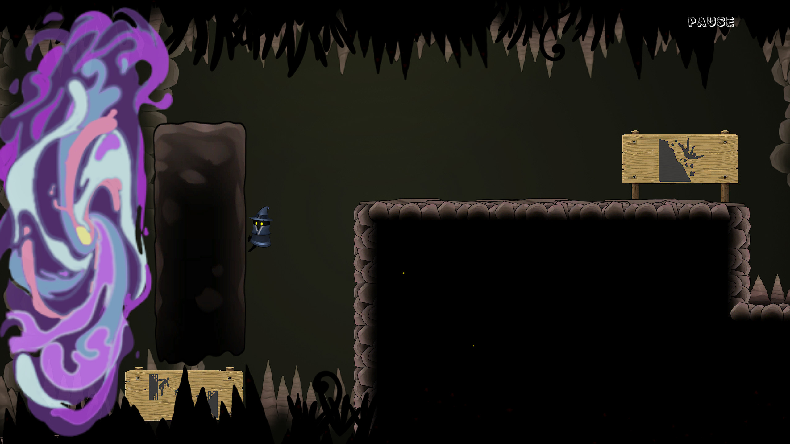
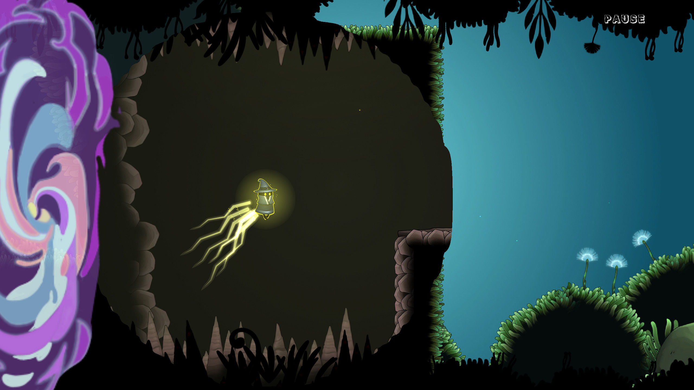
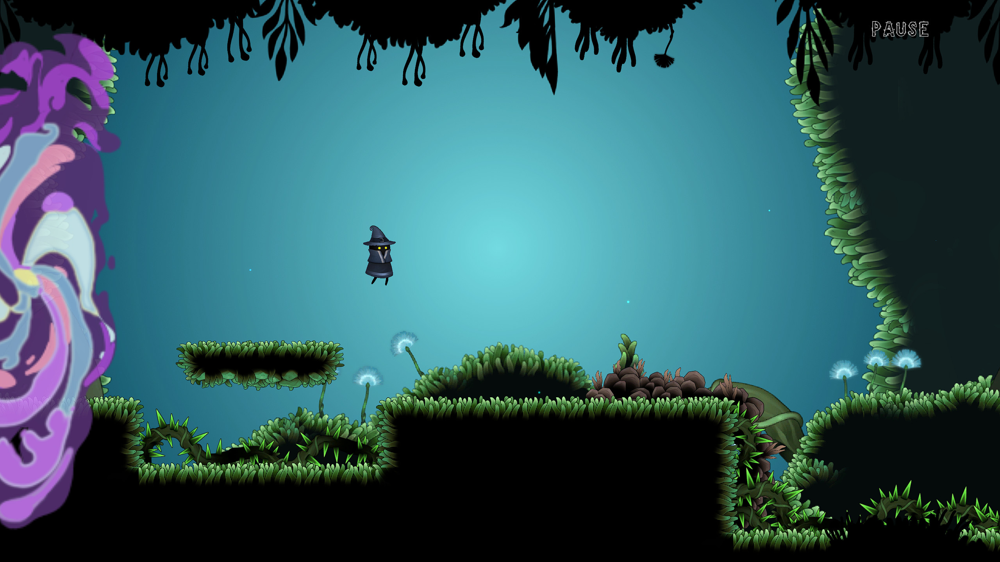

### Time-Jumper

Link to Steam page: [https://store.steampowered.com/app/1555640/Time_Jumper/](https://store.steampowered.com/app/1555640/Time_Jumper/)

- Co-Lead programmer for a 2D platformer built in Unity and published on Steam.
- Worked on all aspects of game development from Level Design, Camera Logic, etc.
- Worked asynchronously with team in different time zones using agile development.

### Asteroids: The Rogue-Like

- Developed a version of the classic Asteroids in Unity from scratch in a solo project.
- Implemented vector based movement.
- Worked on converting the game into a roguelike with an upgrade shop and economy.

[Download Build](Asteroids_The_Roguelike.zip)

### Humans vs. Zombies

- Created a simulation in Unity involving fully autonomous agents with 3D vector based movement.
- Implemented steering behaviors such as pursue, evade, separation.
- Responsible for implementing game-like elements to the simulation like adding more zombies or humans to the scene in real time and the respawning of humans.

[Download Build](Humans_vs_Zombies.zip)

## Contact Me
Mobile: 585 (404) 6888  
 
Email: rashrit@hotmail.com
