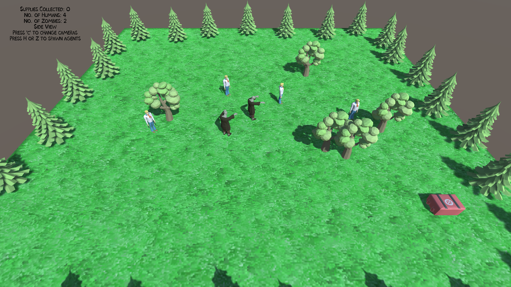

### Asteroids: The Rogue-Like

- Developed a version of the classic Asteroids in Unity from scratch in a solo project.
- Implemented vector based movement.
- Worked on converting the game into a roguelike with an upgrade shop and economy.

[Download Build](Asteroids_The_Roguelike.zip)

### Time-Switcher

- Lead programmer for a 2D platformer in Unity within a team of 3.
- Working on Level Design. Collision detection and some of the movement physics.
- Started project in a game jam and the team has kept up progress since then.

### Humans vs. Zombies

- Created a simulation in Unity involving fully autonomous agents with 3D vector based movement.
- Implemented steering behaviors such as pursue, evade, separation.
- Responsible for implementing game-like elements to the simulation like adding more zombies or humans to the scene in real time and the respawning of humans.

[Download Build](Humans_vs_Zombies.zip)

## Contact Me
Mobile: 585 (404) 6888  
 
Email: rashrit@hotmail.com
